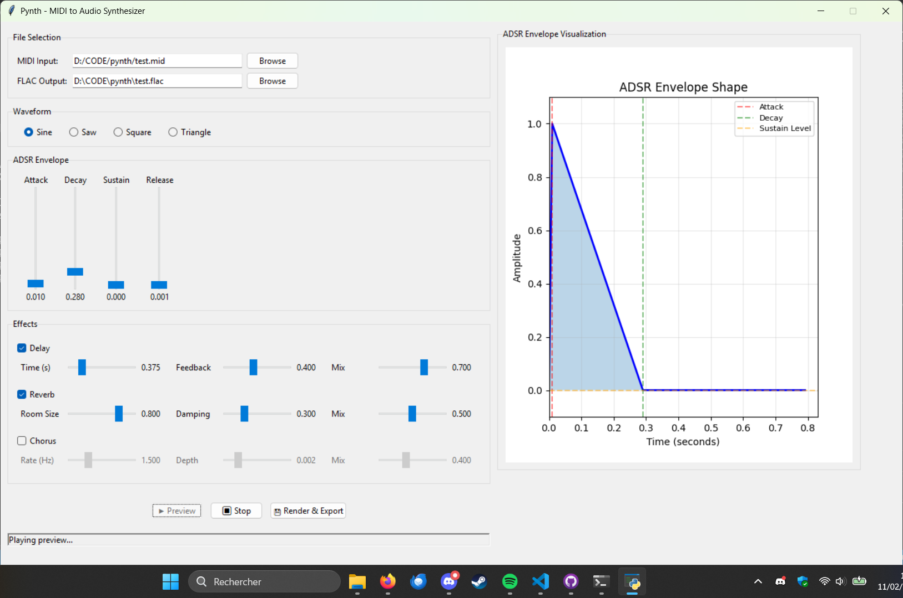

# pynth
`pynth` is a small MIDI player made in python.
by Maxence Marchand, 2026

## Features
- Reading MIDI files (in single track mode)
- Choice of waveform : sine, saw, square or triangle
- ADSR envelope modification
- Effects : chorus, delay and reverb
- Audio preview
- Export as FLAC

## How to run pynth
Open a terminal in the `pynth` folder and type : 

``` pip install -e .```

If you wish to run the GUI version (recommended) : 

``` pynth-gui ``` and play around.



If you wish to use the CLI version : 

``` pynth-cli input.mid output.flac ```

Improvements to the CLI version are being worked on, to allow ADSR envelope modification and effects.

## Dependencies
- `matplotlib`
- `mido`
- `numpy` 
- `scipy`
- `sounddevice`
- `soundfile`

