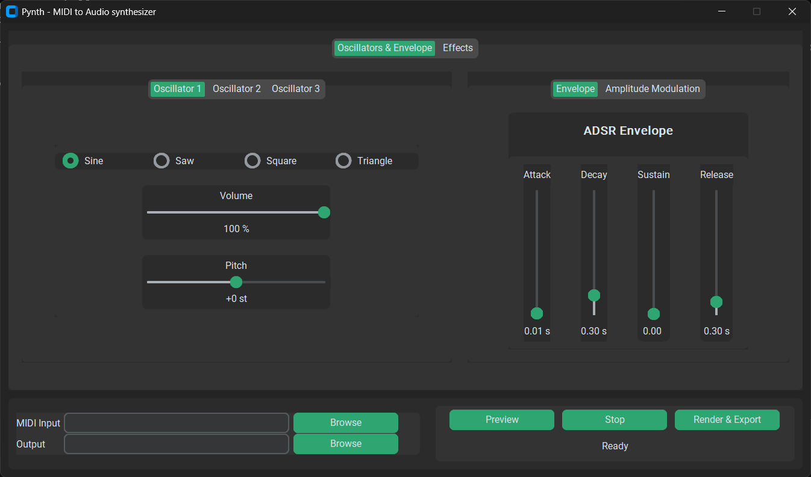

# pynth


`pynth` is a small MIDI player made in python.
by Maxence Marchand, 2026

## Features
- Reading MIDI files (in single track mode)
- Choice of waveform : sine, saw, square or triangle
- ADSR envelope modification
- Effects : chorus, delay and reverb
- Audio preview
- Export as FLAC

## How to run pynth
Open a terminal in the `pynth` folder and type : 

```pip install -e .```

If you wish to run the GUI version (recommended) : 

```pynth-gui``` and play around.



**IMPORTANT** The GUI relies on ```tkinter```.

If you wish to use the CLI version : 

```pynth-cli input.mid output.flac```

**IMPORTANT** The CLI version is limited in features. It uses the default envelope, and only one effect can be applied at a time, with default parameters.

Example usage : 

```pynth-cli input.mid output.flac --waveform square --effect chorus```

## Dependencies
- [`matplotlib`](https://matplotlib.org/)
- [`mido`](https://mido.readthedocs.io/en/stable/)
- [`numpy`](https://numpy.org/)
- [`scipy`](https://scipy.org/)
- [`sounddevice`](https://python-sounddevice.readthedocs.io/en/0.5.3/)
- [`soundfile`](https://pypi.org/project/soundfile/)

