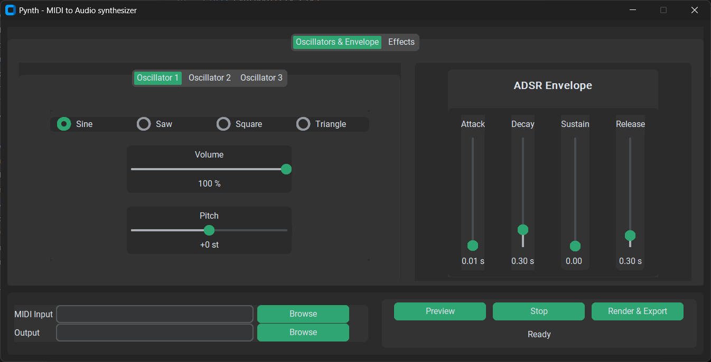

# pynth


`pynth` is a small MIDI player made in python.
by Maxence Marchand, 2026

## Features
- Reading MIDI files (in single track mode)
- Choice of waveform : sine, saw, square or triangle
- ADSR envelope modification
- Effects : chorus, delay and reverb
- Multiple oscillators, with independant waveform, volume and pitch controls
- Audio preview
- Export as FLAC

## How to run pynth
Open a terminal in the `pynth` folder and type : 

```pip install -e .```

Then simply run : 

```pynth``` and play around.




## Future developments

- LFO and filters

## Versions changelog
- 1.0 : first release
- 1.1 : removed CLI, added multiple oscillators, GUI refinements
- 1.2 : reworked GUI : replaced previous tkinter GUI with CustomTkinter

## Dependencies
- [`customtkinter`](https://customtkinter.tomschimansky.com/)
- [`mido`](https://mido.readthedocs.io/en/stable/)
- [`numpy`](https://numpy.org/)
- [`scipy`](https://scipy.org/)
- [`sounddevice`](https://python-sounddevice.readthedocs.io/en/0.5.3/)
- [`soundfile`](https://pypi.org/project/soundfile/)